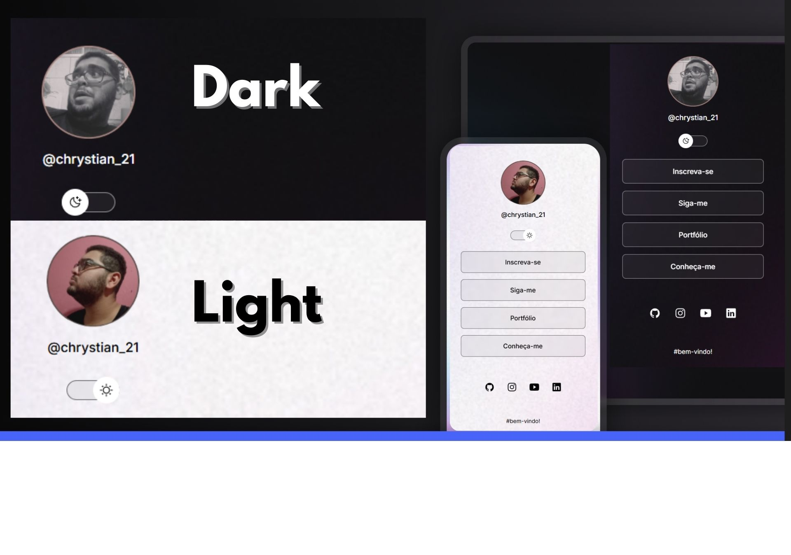

<h1 align="center"> Início de site responsivo </h1>

Este é um projeto prático realizado com o objetivo de aplicar e consolidar conhecimentos nas tecnologias HTML, CSS e JavaScript, resultando no desenvolvimento de uma interface web responsiva.

  <a href="#-tecnologias">Tecnologias</a>&nbsp;&nbsp;&nbsp;|&nbsp;&nbsp;&nbsp;
  <a href="#-projeto">Projeto</a>&nbsp;&nbsp;&nbsp;|&nbsp;&nbsp;&nbsp;
  <a href="#-layout">Layout</a>&nbsp;&nbsp;&nbsp;|&nbsp;&nbsp;&nbsp;
  <a href="#memo-licença">Licença</a>

  

 

  

## 🚀 Tecnologias

Esse projeto foi desenvolvido com as seguintes tecnologias:

- HTML e CSS
- JavaScript
- Git e Github
- Figma

## 💻 Projeto

Este projeto demonstra o desenvolvimento inicial de um website totalmente responsivo. A interface inclui botões personalizados e oferece uma experiência de usuário dinâmica através da funcionalidade de alternância entre os modos noturno e diurno, implementada com HTML, CSS, JavaScript e Figma.

## 🔖 Layout

Você pode visualizar o layout do projeto através [DESSE LINK](https://github.com/Chrystian-dev/projetoi). Não é necessário ter conta no [github.com](https://github.com/) para acessá-lo.

## :memo: Licença

Esse projeto está sob a licença MIT.

---

Feito com ♥ por Chrystian.V  [Gostou do resultado?
Transforme a sua ideia em realidade. Contrate-me!](https://www.linkedin.com/in/chrystian-victor/)